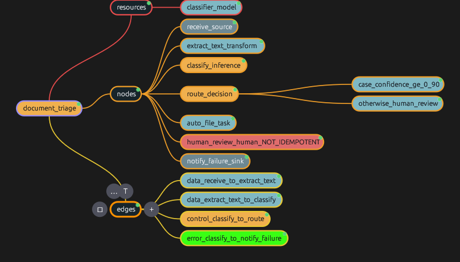
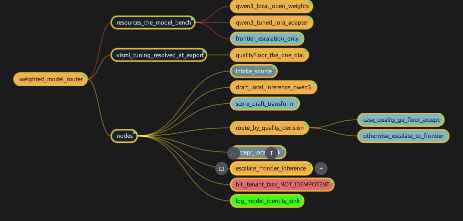

# Worked harness examples, as Rumima `.rmmx` maps

These are **real Rumima documents**, built in Rumima Enterprise Studio and saved
as `.rmmx`. The screenshots beside them are captures of the actual application
rendering these maps — not mock-ups.

| map | screenshot | what it demonstrates |
|---|---|---|
| [`document-triage.rmmx`](document-triage.rmmx) |  | the five typed edge relationships, confidence-gated routing, a non-idempotent human step, an error path |
| [`weighted-model-router.rmmx`](weighted-model-router.rmmx) |  | weighted model selection, LoRA finetuning declared as a resource property, quality-gated escalation from a local qwen3 to a frontier model |

## Reading the colours

The colours are not decoration. They carry the same meaning across every map:

| colour | meaning |
|---|---|
| **gold** `#f0b04e` | the lit path — inference and decisions, where models run and the workflow branches |
| **teal** `#7fb8c4` | dormant structure — transforms and data movement, pure and freely retryable |
| **red** `#e06c6c` | danger — steps that must never be auto-retried, and error paths |
| **grey** `#6d8892` | boundaries — where data enters and leaves the workflow |

A node showing green in a screenshot is Rumima's **current selection**
highlight, not a harness colour.

## The three layers

```
.rmmx                          the Rumima document — the file in this folder
  └── .visml markup            presentation, plus tuning and weight injection
        └── <harness>          a complete HarnessXML document, embedded
```

Export lifts the `<harness>` element out as `.hxml`. Only that crosses the
boundary between tools — a runtime never sees `.rmmx` or `.visml`, which is
exactly what makes the runtime replaceable.

## Opening them

Open a `.rmmx` in [Rumima](https://rumima.visml.com/). Every node's description
carries the corresponding HarnessXML fragment and the reasoning behind it, so
the map is readable as documentation even without the Studio extension.

`.rmmx` is a container; the harness content lives in the node descriptions.

## Licence

Apache-2.0, same as the rest of the examples. Copyright 2026 VisML.
